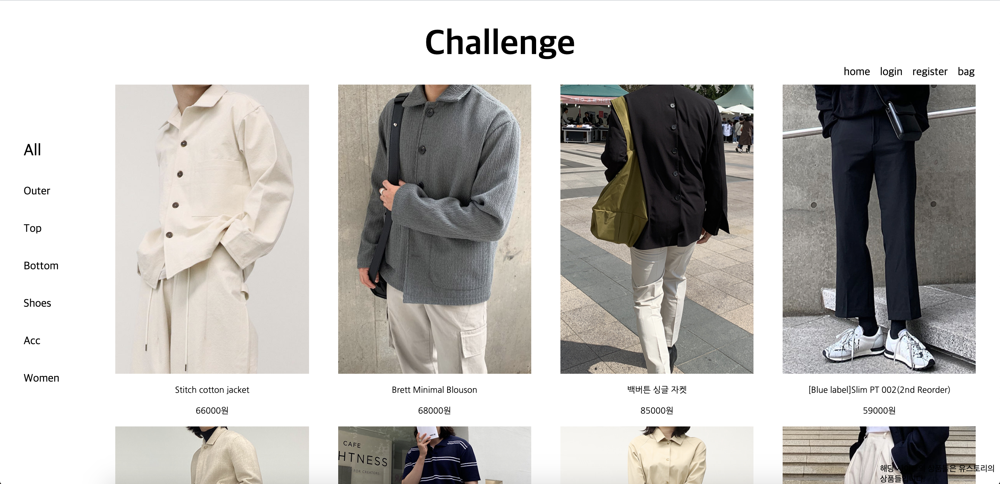
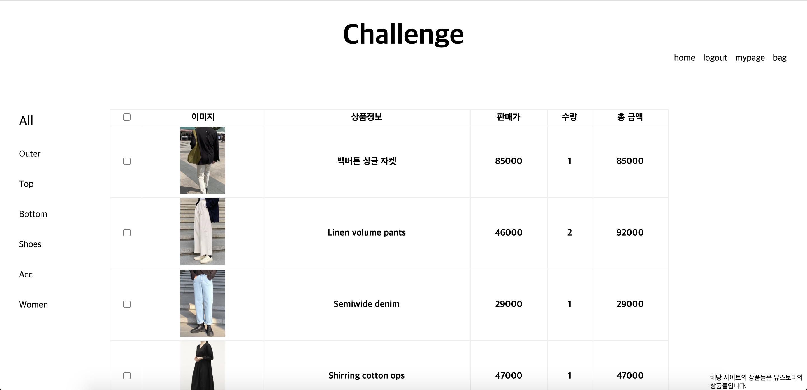
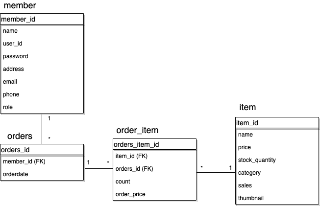

# spring-boot-challenge 
spring-boot 와 spring-data-jpa를 이용한 쇼핑몰 구현하기

접속 URL : 
http://52.78.141.17:8080/

+ 프로그램 기능 목록
  + 로그인
  + 회원가입
  + 카테고리 별 상품조회
  + 장바구니
  + 구매 기능
  + 게시판
  + 공지사항

+ 구현해야 할 것들
  + 상품 정보 수집 (쇼핑몰 크롤링) V
  + 뷰 작성 V
    + 인덱스 페이지 V
    + 상품 리스트 페이지 V
    + 상품 디테일 페이지 V
    + 회원 가입 페이지 V
    + 로그인 페이지 V
    + 장바구니 페이지 V
    + 공지사항 페이지
  + js 파일 작성 V
  + 상품 조회 기능 V
  + 페이징 기능 V
  + 회원 가입 기능 V
    + BCryptPasswordEncoder로 패스워드 암호화 V
  + 로그인 기능 V
    + Spring security V
    + 로그인 시 로그아웃, 마이 페이지 버튼 활성화 V
    + BCryptPasswordEncoder로 패스워드 암호화 V
  + 장바구니 기능 구현 V
    + 로그인 필수 V
    + 로그아웃 시 세션과 함께 삭제 V
  + 구매 기능 구현 V
    + 구매 버튼 클릭 시 디비에 저장 V
    + 구매 버튼 클릭 시 장바구니 삭제
  + 필요한 모든 로직에 대한 단위 테스트 작성
  + 배포
    + EC2에 프로젝트 설치
    + Travis 연결
    + Travis - AWS S3 연결
  
+ 개인적인 목표
  + 코드 중복 최소화
  + 객체지향 원칙 지키기
  + Spring security를 이용하여 로그인 및 세션관리 구현하기
  
Screenshots
------
  

  
  

+ 개발 환경
  + 개발 언어 : Java
  + 프레임워크 : Spring-boot, Spring-data-JPA
  + 서버 : AWS
  + 데이터베이스 : AWS RDS (MariaDB)
  + 개발 일시 : 2020/06/21 ~ 2020/07/09
  
  
